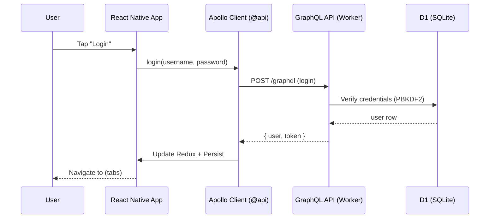
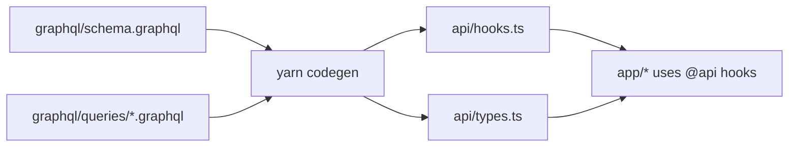

# 🌍 Safarnak

> **سفرناک** - A modern offline-first travel companion built with Expo React Native and Cloudflare Workers

[](https://www.typescriptlang.org/)
[](https://reactnative.dev/)
[](https://expo.dev/)
[](https://workers.cloudflare.com/)
[](https://the-guild.dev/graphql/codegen)
[](https://reactnative.dev/blog/2024/10/23/the-new-architecture-is-here)
[](LICENSE)
[](https://github.com/mehotkhan/safarnak.app/releases)
[](https://github.com/mehotkhan/safarnak.app/actions)

**Live Demo**: [safarnak.mohet.ir](https://safarnak.mohet.ir) | **Download APK**: [Latest Release](https://github.com/mehotkhan/safarnak.app/releases)

---

## Table of Contents
- [What is This?](#-what-is-this)
- [Architecture Overview](#-architecture-overview)
- [Quick Start](#-quick-start)
- [Codebase Structure](#-codebase-structure)
- [How to Add New Features](#-how-to-add-new-features)
- [Configuration](#-configuration)
- [Common Commands](#-common-commands)
- [Technology Stack](#-technology-stack)
- [Development Tips](#-development-tips)
- [Authentication Flow](#-authentication-flow)
- [Internationalization](#-internationalization)
- [Key Concepts](#-key-concepts)
- [License](#-license)
- [Resources](#-resources)

## 📚 What is This?

A full-stack mobile travel app with **perfect separation** between client (React Native) and server (Cloudflare Workers) code in a **single-root monorepo**.

### Key Concepts

- **Client** (React Native): Expo app with Redux, Apollo Client, offline-first architecture
- **Server** (Cloudflare Workers): Serverless GraphQL API with Cloudflare D1 database
- **Shared** (GraphQL + Drizzle): Type-safe schema shared between client and server
- **Codegen**: Auto-generates TypeScript types and React hooks from GraphQL schema

---

## 🏗️ Architecture Overview

### System Architecture

```mermaid
flowchart LR
  subgraph Client [React Native Client (Expo)]
    A[app/ (Expo Router pages)]
    B[components/ (UI + contexts)]
    C[store/ (Redux + Persist)]
    D[api/ (Apollo Client + generated hooks)]
  end

  subgraph Shared [Shared]
    E[graphql/ (Schema + Operations)]
    F[drizzle/ (DB schema)]
  end

  subgraph Worker [Cloudflare Worker (GraphQL API)]
    G[worker/ (Resolvers + GraphQL Yoga)]
    H[(D1 Database · SQLite)]
  end

  A --> D
  B --> D
  C --> D
  D <-->|HTTPS GraphQL| G
  G --> H
  E --> D
  E --> G
  F --> G
  F --> H
```

### Runtime Data Flow (example: Login)



### Dev-time GraphQL Pipeline



### Offline-first Flow (client)

```mermaid
flowchart LR
  MUT[Dispatch mutation]
  MID[offlineMiddleware]
  NET{Online?}
  QUEUE[Persist queue (AsyncStorage)]
  SEND[Apollo mutate]
  RETRY[On reconnect]

  MUT --> MID
  MID --> NET
  NET -- No --> QUEUE
  NET -- Yes --> SEND
  QUEUE --> RETRY --> SEND
```

### How It Works

1. **Define GraphQL Schema** (`graphql/schema.graphql`) - Shared between client and worker
2. **Define Operations** (`graphql/queries/*.graphql`) - Queries and mutations
3. **Run Codegen** - Auto-generates TypeScript types and React hooks in `api/`
4. **Implement Resolvers** (`worker/queries/`, `worker/mutations/`) - Server-side logic
5. **Use in App** (`app/`, `components/`) - Import generated hooks from `@api`

---

## 🚀 Quick Start

### Prerequisites

- Node.js 20+
- Yarn package manager

### Setup (5 minutes)

```bash
# Clone and install
git clone https://github.com/mehotkhan/safarnak.app.git
cd safarnak.app
yarn install

# Setup database
yarn db:migrate

# Generate GraphQL types
yarn codegen

# Start development
yarn dev  # Runs both worker (8787) and client (8081)
```

### Run on Device

```bash
yarn android     # Android (legacy)
yarn android:newarch  # Android (new architecture)
yarn ios         # iOS (macOS only)
yarn web         # Web browser
```

---

## 📁 Codebase Structure

### Client-Side (What You'll Modify Most)

```
app/                    # 📱 Expo Router file-based pages
├── auth/              # Authentication pages
│   ├── login.tsx     # Login page (auto-redirect if logged in)
│   └── register.tsx   # Registration page
└── (tabs)/            # Main app tabs
    ├── index.tsx      # Home screen
    ├── tour.tsx       # Tours list
    └── profile.tsx    # User profile

components/            # 🎨 Reusable UI components
├── AuthWrapper.tsx    # Authentication guard
├── MapView.tsx        # Map component
└── context/           # React contexts (language, theme)

api/                    # 🌐 GraphQL client (auto-generated)
├── hooks.ts           # ✨ Generated React hooks
├── types.ts           # ✨ Generated TypeScript types
└── client.ts          # Apollo Client setup

store/                  # 📦 Redux state
├── slices/            # State slices
│   ├── authSlice.ts   # Auth state
│   └── themeSlice.ts  # Theme state
└── middleware/        # Redux middleware
    └── offlineMiddleware.ts  # Offline queue

constants/              # 📋 App configuration
hooks/                   # 🪝 Custom React hooks
locales/                 # 🌍 i18n translations (en, fa)
```

### Server-Side

```
worker/                 # ⚡ Cloudflare Worker
├── queries/           # Query resolvers (getMessages, me)
├── mutations/        # Mutation resolvers (register, login)
└── subscriptions/    # Subscription resolvers (newMessages)

graphql/               # 📡 Shared GraphQL
├── schema.graphql    # GraphQL schema (shared)
└── queries/          # Query definitions (.graphql files)

drizzle/               # 🗄️ Database (shared)
├── schema.ts         # Database schema
└── migrations/       # SQL migrations
```

### Shared (Critical)

- **`graphql/`** - GraphQL schema and operations (shared between client & worker)
- **`drizzle/`** - Database schema (shared between client & worker)
- **`api/`** - Auto-generated client code (run `yarn codegen` to update)

---

## 💡 How to Add New Features

### Adding a GraphQL Query/Mutation

1. **Define in GraphQL Schema**:
```graphql
# graphql/schema.graphql
type Query {
  getTours: [Tour!]!
}
```

2. **Create Operation File**:
```graphql
# graphql/queries/getTours.graphql
query GetTours {
  getTours {
    id
    name
    location
  }
}
```

3. **Run Codegen**:
```bash
yarn codegen
```

4. **Implement Resolver**:
```typescript
// worker/queries/getTours.ts
export const getTours = async (_: any, __: any, context: any) => {
  const db = drizzle(context.env.DB);
  return await db.select().from(tours).all();
};
```

5. **Use in Component**:
```typescript
import { useGetToursQuery } from '@api';

function ToursScreen() {
  const { data, loading } = useGetToursQuery();
  // ...use data
}
```

### Adding a New UI Component

1. **Create Component**:
```typescript
// components/TourCard.tsx
import { CustomText } from '@components/ui/CustomText';
import { View } from '@components/ui/Themed';

interface TourCardProps {
  tour: { id: string; name: string };
}

export default function TourCard({ tour }: TourCardProps) {
  return (
    <View>
      <CustomText>{tour.name}</CustomText>
    </View>
  );
}
```

2. **Use Path Aliases**:
```typescript
import { useColorScheme } from '@hooks/useColorScheme';
import { colors } from '@constants/Colors';
import { useAppDispatch } from '@store/hooks';
```

### Adding to Redux Store

1. **Create Slice**:
```typescript
// store/slices/toursSlice.ts
import { createSlice } from '@reduxjs/toolkit';

const toursSlice = createSlice({
  name: 'tours',
  initialState: { tours: [] },
  reducers: {
    setTours: (state, action) => {
      state.tours = action.payload;
    },
  },
});

export const { setTours } = toursSlice.actions;
export default toursSlice.reducer;
```

2. **Add to Store**:
```typescript
// store/index.ts
import toursReducer from './slices/toursSlice';

// Add to combineReducers
tours: toursReducer,
```

---

## 🔧 Configuration

### Path Aliases

```typescript
import { useLoginMutation } from '@api';
import { useAppDispatch } from '@store/hooks';
import { login } from '@store/slices/authSlice';
import { useColorScheme } from '@hooks/useColorScheme';
import { colors } from '@constants/Colors';
import Colors from '@constants/Colors';
```

**Never use relative imports** (`../../api`, `../store`). Always use path aliases.

### GraphQL Codegen

Auto-generates TypeScript types and React hooks from GraphQL schema:

1. **Schema** (`graphql/schema.graphql`) defines types
2. **Operations** (`graphql/queries/*.graphql`) define queries/mutations
3. **Run** `yarn codegen` to generate `api/hooks.ts` and `api/types.ts`
4. **Use** generated hooks: `import { useLoginMutation } from '@api'`

**Important**: Always run `yarn codegen` after modifying GraphQL schema or operations.

---

## 📋 Common Commands

```bash
# Development
yarn dev              # Start both worker & client
yarn start            # Expo dev server only
yarn worker:dev       # Worker only

# Database
yarn db:migrate       # Apply migrations
yarn db:studio        # Open Drizzle Studio

# GraphQL
yarn codegen          # Generate types & hooks
yarn codegen:watch    # Watch mode

# Build
yarn android          # Run on Android
yarn build:release    # Build release APK

# Utilities
yarn clean            # Clear caches
yarn lint             # Check code quality
yarn lint:fix         # Fix issues
```

---

## 🛠️ Technology Stack

| Layer | Technology | Purpose |
|-------|-----------|---------|
| **Frontend** | React Native 0.81.5 | Mobile UI |
| **Backend** | Cloudflare Workers | Serverless API |
| **Database** | Cloudflare D1 (SQLite) | Server database |
| **GraphQL** | GraphQL Yoga | API layer |
| **ORM** | Drizzle 0.44.6 | Type-safe queries |
| **State** | Redux Toolkit | Client state |
| **Codegen** | GraphQL Codegen | Auto-generate types |
| **Router** | Expo Router | File-based routing |

**Full stack**: TypeScript, ESLint, Prettier, React i18n, New Architecture enabled

---

## 🧪 Development Tips

1. **Metro Cache Issues**: Run `yarn clean`
2. **Database Reset**: Delete `.wrangler/state/v3/d1/` and run `yarn db:migrate`
3. **Type Errors**: Run `yarn codegen` to regenerate types
4. **GraphQL Changes**: Always run `yarn codegen` after schema changes
5. **Worker Logs**: Check terminal running `yarn worker:dev`
6. **Worker URL**: `http://127.0.0.1:8787/graphql`

---

## 🔐 Authentication Flow

1. User logs in → Client calls `login` mutation
2. Worker validates → Returns user + token
3. Client stores → Redux + AsyncStorage
4. Apollo adds token → Automatic auth headers
5. Auto-redirect → Logged-in users can't access auth pages

**Auth Pages**: `app/auth/login.tsx` and `app/auth/register.tsx`  
**Auth Guard**: `components/AuthWrapper.tsx`

---

## 🌍 Internationalization

Supports English and Persian (Farsi) with automatic RTL:

```typescript
import { useTranslation } from 'react-i18next';

const { t } = useTranslation();
<CustomText>{t('common.welcome')}</CustomText>
```

**Translation files**: `locales/en/translation.json`, `locales/fa/translation.json`

---

## 🎯 Key Concepts

### Perfect Separation

- **`graphql/`** - Shared schema and operations
- **`api/`** - Auto-generated client code only
- **`worker/`** - Server-only resolvers
- **`drizzle/`** - Shared database schema

### Auto-Generated Code

**Never manually edit**:
- `api/hooks.ts` - Generated React hooks
- `api/types.ts` - Generated TypeScript types

These are generated from `graphql/schema.graphql` and `graphql/queries/*.graphql`.

### Path Aliases

Always use aliases, never relative imports:
- ✅ `@api`, `@store/hooks`, `@hooks/useColorScheme`
- ❌ `../../api`, `../store/hooks`

---

## 📄 License

MIT

---

## 🔗 Resources

- [Expo Docs](https://docs.expo.dev/)
- [Cloudflare Workers](https://developers.cloudflare.com/workers/)
- [GraphQL Codegen](https://the-guild.dev/graphql/codegen)
- [Drizzle ORM](https://orm.drizzle.team/)

Built with ❤️ using Expo, Cloudflare Workers, and GraphQL Codegen
