# 🌍 Safarnak

> **سفرناک** - A modern offline-first travel companion built with Expo React Native and Cloudflare Workers

[](https://www.typescriptlang.org/)
[](https://reactnative.dev/)
[](https://expo.dev/)
[](https://workers.cloudflare.com/)
[](https://the-guild.dev/graphql/codegen)
[](https://reactnative.dev/blog/2024/10/23/the-new-architecture-is-here)
[](LICENSE)
[](https://github.com/mehotkhan/safarnak.app/releases)
[](https://github.com/mehotkhan/safarnak.app/actions)

**Live Demo**: [safarnak.app](https://safarnak.app) | **Download APK**: [Latest Release](https://github.com/mehotkhan/safarnak.app/releases)

---

## Table of Contents
- [What is This?](#-what-is-this)
- [Architecture Overview](#-architecture-overview)
- [Quick Start](#-quick-start)
- [Codebase Structure](#-codebase-structure)
- [Routing & URLs](#-routing--urls)
- [Database Model](#-database-model-er-diagram)
- [How to Add New Features](#-how-to-add-new-features)
- [Configuration](#-configuration)
- [Common Commands](#-common-commands)
- [Technology Stack](#-technology-stack)
- [Development Tips](#-development-tips)
- [Authentication Flow](#-authentication-flow)
- [Internationalization](#-internationalization)
- [Key Concepts](#-key-concepts)
- [Offline-First Architecture](#-offline-first-architecture)
- [Technical Review & Checklist (Summary)](#-technical-review--checklist-summary)
- [Contributing](#-contributing)
- [Code of Conduct](#-code-of-conduct)
- [Suggested Improvements](#-suggested-improvements)
- [License](#-license)
- [Resources](#-resources)

## 📚 What is This?

**Safarnak** (سفرناک) is a full‑stack, offline‑first travel companion. It helps users discover destinations, plan trips, and share experiences. The project is a single‑root monorepo with a clean separation of concerns and shared types across client and server.

### Highlights

- **Offline‑first by design**: Automatic Apollo → Drizzle sync via `DrizzleCacheStorage` on every cache write. Works seamlessly offline with SQL queries over cached data.
- **Shared GraphQL + Codegen**: One schema in `graphql/` powers both the Worker and the client. Codegen produces strongly‑typed hooks in `api/`.
- **Unified Drizzle schema**: A single `database/schema.ts` defines both server tables (Cloudflare D1) and client cached tables (Expo SQLite), all with UUID IDs. Separate adapters (`server.ts`, `client.ts`) consume the same schema.
- **Edge backend**: Cloudflare Workers with GraphQL Yoga, Cloudflare D1 (SQLite), KV, R2, and Durable Objects for real‑time subscriptions.
- **Modern RN stack**: React 19, Expo Router 6, NativeWind 4 (Tailwind), New Architecture enabled.
- **Great DX**: Path aliases, one‑command dev, `yarn codegen`, `yarn db:migrate`, friendly linting.

### Onboarding roadmap

- Start with [Quick Start](#-quick-start) (install, migrate DB, codegen, run dev)
- Skim [Architecture Overview](#-architecture-overview) (keep charts; refer often)
- Learn the [Schema → Codegen → Hooks](#-how-to-add-new-features) workflow
- Review [Offline‑First Architecture](#-offline-first-architecture) and local DB usage

---

## 🏗️ Architecture Overview

### System Architecture (High-Level)

```mermaid
flowchart TB
  subgraph Client["📱 Client Layer (React Native + Expo)"]
    subgraph UI["UI Layer"]
      A["app/ - Expo Router Pages"]
      B["ui/ - UI Components, Hooks, State, Utils"]
    end
    subgraph State["State Management"]
      C["ui/state/ - Redux + Persist"]
      D["api/ - Apollo Client + DrizzleCacheStorage"]
    end
    subgraph Local["Local Storage"]
      E["Apollo Cache<br/>(raw)"]
      F["Drizzle Cache<br/>(structured)"]
      G["AsyncStorage<br/>(Mutation Queue)"]
    end
  end

  subgraph Shared["🔗 Shared Layer"]
    H["graphql/ - Schema + Operations"]
    I["database/schema.ts - Shared Drizzle Schema<br/>(Server + Client Tables)"]
  end

  subgraph Worker["⚡ Server Layer (Cloudflare Workers)"]
    J["worker/ - GraphQL Resolvers"]
    K["GraphQL Yoga Server"]
    L["D1 Database<br/>(SQLite)"]
    M["KV Store<br/>(Sessions/Cache)"]
    N["Vectorize<br/>(Embeddings)"]
    O["R2 Storage<br/>(Media Files)"]
  end

  A --> C
  B --> C
  C --> D
  D --> E
  D --> F
  D --> G
  D <-->|HTTPS GraphQL<br/>Auth Headers| K
  K --> J
  J --> L
  J --> M
  J --> N
  J --> O
  H --> D
  H --> K
  I --> F
  I --> L
  I --> J
```



### Client Architecture (Detailed)


### Data Flow Architecture


### Offline-First Sync Architecture


### Storage Layer Architecture


### Authentication Flow


### Error Handling Architecture


### Network Status & Connectivity


### Dev-time GraphQL Codegen Pipeline


### Complete Request Lifecycle


### How It Works

1. **Define GraphQL Schema** (`graphql/schema.graphql`) - Shared between client and worker
2. **Define Operations** (`graphql/queries/*.graphql`) - Queries and mutations
3. **Run Codegen** - Auto-generates TypeScript types and React hooks in `api/`
4. **DrizzleCacheStorage** (`api/cache-storage.ts`) - Automatically syncs Apollo cache to Drizzle on every cache write
5. **Implement Resolvers** (`worker/queries/`, `worker/mutations/`) - Server-side logic using `getServerDB()` from `@database/server`
6. **Use in App** (`app/`, `ui/`) - Import hooks from `@api` (automatic sync via DrizzleCacheStorage)

---

## 🚀 Quick Start

### Prerequisites

- **Node.js 20+** (check with `node --version`)
- **Yarn** package manager (install via `npm install -g yarn`)
- **Android Studio** (for Android development)
- **Git** (for cloning the repository)

### Setup (5-10 minutes)

```bash
# 1. Clone the repository
git clone https://github.com/mehotkhan/safarnak.app.git
cd safarnak.app

# 2. Install dependencies
yarn install

# 3. Setup local database (Cloudflare D1)
yarn db:migrate

# 4. Generate GraphQL types and hooks
yarn codegen

# 5. Start development servers
yarn dev  # Runs both worker (port 8787) and Expo client (port 8081)
```

This will start:
- **Cloudflare Worker** on `http://localhost:8787` (GraphQL API)
- **Expo Dev Server** on `http://localhost:8081` (React Native app)

### Run on Device/Emulator

```bash
# Android (New Architecture - recommended)
yarn android:newarch

# Android (Legacy Architecture)
yarn android

# Web browser
yarn web

# iOS (macOS only, not actively tested)
yarn ios
```

### First Time Setup Tips

- **Worker URL**: If you see connection errors, check that the worker is running on port 8787
- **GraphQL Playground**: Visit `http://localhost:8787/graphql` to test GraphQL queries
- **Metro Bundler**: If you see cache issues, run `yarn clean` and restart
- **Database**: The local D1 database is stored in `.wrangler/state/v3/d1/`

### Verify Installation

1. Check worker is running: Visit `http://localhost:8787/graphql` - you should see GraphQL Playground
2. Check Expo: Open Expo Go app on your phone or press `w` for web
3. Try a query: In GraphQL Playground, run `{ me { id username } }` (after logging in)

---

## 📁 Codebase Structure

### Client-Side (React Native - What You'll Modify Most)

```
app/                          # 📱 Expo Router pages (file-based routing)
├── _layout.tsx              # Root layout with providers
├── (auth)/                  # Auth route group (public routes)
│   ├── _layout.tsx         # Auth stack layout
│   ├── welcome.tsx         # /auth/welcome
│   ├── login.tsx           # /auth/login
│   └── register.tsx        # /auth/register
└── (app)/                   # Main app group (protected routes)
    ├── _layout.tsx         # Tab bar layout (4 tabs: feed, explore, trips, profile)
    ├── (feed)/             # Feed tab
    │   ├── index.tsx       # / (home feed)
    │   ├── [id].tsx        # /:id (post detail)
    │   └── new.tsx         # /new (create post)
    ├── (explore)/          # Explore tab
    │   ├── index.tsx       # /explore
    │   ├── places/[id].tsx # /explore/places/:id
    │   ├── tours/[id].tsx  # /explore/tours/:id
    │   ├── tours/[id]/book.tsx # /explore/tours/:id/book
    │   ├── locations/[id].tsx  # /explore/locations/:id
    │   └── users/[id].tsx  # /explore/users/:id
    ├── (trips)/            # Trips tab
    │   ├── index.tsx       # /trips (trip list)
    │   ├── new.tsx         # /trips/new (create trip)
    │   └── [id]/           # /trips/:id
    │       ├── index.tsx   # Trip details
    │       └── edit.tsx    # Edit trip
    └── (profile)/          # Profile tab
        ├── index.tsx       # /profile
        ├── edit.tsx        # /profile/edit
        ├── trips.tsx       # /profile/trips
        ├── messages.tsx    # /profile/messages
        ├── messages/[id].tsx # /profile/messages/:id
        ├── notifications/[id].tsx # /profile/notifications/:id
        ├── payments.tsx    # /profile/payments
        ├── subscription.tsx # /profile/subscription
        └── settings.tsx    # /profile/settings

ui/                           # 🎨 All client UI code
├── auth/                    # Authentication components
│   └── AuthWrapper.tsx      # Authentication guard
├── maps/                    # Map components
│   ├── MapView.tsx          # Leaflet-based map
│   └── MapView.tsx          # Leaflet WebView map
├── forms/                   # Form components
│   ├── CustomButton.tsx
│   ├── InputField.tsx
│   ├── TextArea.tsx
│   └── ...
├── display/                 # Display components
│   ├── CustomText.tsx
│   ├── UserAvatar.tsx
│   └── ...
├── feedback/                # Loading/error states
│   ├── LoadingState.tsx
│   ├── ErrorState.tsx
│   └── ...
├── context/                 # React contexts
│   ├── LanguageContext.tsx
│   ├── LanguageSwitcher.tsx
│   └── ThemeContext.tsx
├── hooks/                   # 🪝 Custom React hooks
│   ├── useColorScheme.ts
│   ├── useAuth.ts
│   └── ...
├── state/                   # 📦 Redux Toolkit state management
│   ├── index.ts             # Store configuration
│   ├── hooks.ts             # Typed hooks (useAppDispatch, useAppSelector)
│   ├── slices/              # Redux slices
│   │   ├── authSlice.ts
│   │   └── themeSlice.ts
│   └── middleware/          # Redux middleware
│       └── offlineMiddleware.ts
└── utils/                   # Client utilities
    ├── clipboard.ts
    ├── validation.ts
    └── ...

api/                          # 🌐 GraphQL client layer
├── hooks.ts                 # ✨ Auto-generated React Apollo hooks (never edit manually)
├── types.ts                 # ✨ Auto-generated TypeScript types (never edit manually)
├── cache-storage.ts         # DrizzleCacheStorage - automatic Apollo → Drizzle sync
├── client.ts                # Apollo Client setup
├── utils.ts                 # API utilities
├── globals.d.ts             # TypeScript global declarations
└── index.ts                 # Main exports

constants/                    # 📋 App constants
├── app.ts                   # App-wide constants
├── Colors.ts                # Color palette (light/dark themes)
└── index.ts                 # Exports

locales/                      # 🌍 i18n translation files
├── en/translation.json      # English translations
└── fa/translation.json      # Persian (Farsi) translations

global.css                    # 🎨 Tailwind CSS directives (@tailwind base/components/utilities)
tailwind.config.js           # 🎨 Tailwind configuration (NativeWind v4)
babel.config.js              # ⚙️ Babel config (NativeWind preset)
metro.config.js              # 📦 Metro bundler config (path aliases, NativeWind)
```

### Server-Side

```
worker/                 # ⚡ Cloudflare Worker
├── queries/           # Query resolvers (getMessages, me)
├── mutations/        # Mutation resolvers (register, login)
└── subscriptions/    # Subscription resolvers (newMessages)

graphql/               # 📡 Shared GraphQL
├── schema.graphql    # GraphQL schema (shared)
└── queries/          # Query definitions (.graphql files)

database/              # 🗄️ Shared database schema and adapters
├── schema.ts         # Unified schema with UUIDs (server + client tables in one file)
├── server.ts         # Server adapter (Cloudflare D1) - exports getServerDB()
├── client.ts         # Client adapter (Expo SQLite) - exports getLocalDB(), sync utilities
├── index.ts          # Main exports (re-exports from schema, server, client)
├── types.ts          # Database types
└── utils.ts          # UUID utilities (createId, isValidId)
migrations/           # Server-only migrations (Cloudflare D1, at project root)
```

## 🧭 Routing & URLs

Safarnak uses **Expo Router** with file-based routing. Routes are organized into groups using parentheses (which don't appear in URLs).

### Auth Routes (Public)
- `/auth/welcome` – Onboarding/Welcome screen
- `/auth/login` – User login
- `/auth/register` – User registration

### App Routes (Protected - Requires Authentication)

#### Feed Tab (`(feed)`)
- `/` – Home feed (social posts from community)
- `/:id` – Post detail view with comments
- `/new` – Create new post

#### Explore Tab (`(explore)`)
- `/explore` – Main explore/search page
- `/explore/places/:id` – Place details page
- `/explore/tours/:id` – Tour details page
- `/explore/tours/:id/book` – Tour booking page
- `/explore/locations/:id` – Location details page
- `/explore/users/:id` – User profile (public view)

#### Trips Tab (`(trips)`)
- `/trips` – User's trip list
- `/trips/new` – Create new trip (AI-powered)
- `/trips/:id` – Trip details view
- `/trips/:id/edit` – Edit trip

#### Profile Tab (`(profile)`)
- `/profile` – User profile home
- `/profile/edit` – Edit profile
- `/profile/trips` – User's trips list
- `/profile/messages` – Messages inbox
- `/profile/messages/:id` – Individual message/conversation
- `/profile/notifications` – Notifications list
- `/profile/notifications/:id` – Notification detail
- `/profile/payments` – Payment history
- `/profile/subscription` – Subscription management
- `/profile/settings` – App settings

### Route Organization
- Route groups `(auth)` and `(app)` don't appear in URLs
- Tab groups `(feed)`, `(explore)`, `(trips)`, `(profile)` don't appear in URLs
- Dynamic routes use `[id]` in file names
- Nested routes create URL paths (e.g., `trips/[id]/edit.tsx` → `/trips/:id/edit`)

## 🗄️ Database Model (ER Diagram)


### Data Storage Architecture

- **D1 (Relational DB with Drizzle)**: 
  - **Server Tables**: Users, user preferences, trips, itineraries, plans, tours, messages, posts, comments, reactions, payments, user subscriptions (tiers), devices, notifications, locations, places, thoughts, subscriptions (GraphQL subscriptions).
  - **All IDs are UUID (text)** - consistent across server and client
  - **Shared Schema**: Same schema definitions used by both server (D1) and client (expo-sqlite) adapters
- **KV (Key-Value Store)**: Sessions (user tokens stored as `token:userId`), cache (external API data like TripAdvisor, web searches).
- **Vectorize (Vector DB)**: Embeddings (user preferences, destinations, places, activities for similarity searches).
- **R2 (Object Storage)**: Avatars, image URLs, galleries, attachments (media, maps, docs).
- **Durable Objects**: Real-time subscriptions (connection state for GraphQL subs via `SubscriptionPool`).

**Note**: The ER diagram above shows the server-side D1 database schema. The client uses cached versions of these tables (e.g., `cachedUsers`, `cachedTrips`) with additional sync metadata fields (`cachedAt`, `lastSyncAt`, `pending`) for offline-first functionality.

### Shared (Critical)

- **`graphql/`** - GraphQL schema and operations (shared between client & worker)
- **`database/schema.ts`** - Unified Drizzle schema (shared between client & worker - same table definitions, different adapters)
  - Server tables: `users`, `trips`, `tours`, etc. (used by worker via `database/server.ts`)
  - Client cached tables: `cachedUsers`, `cachedTrips`, etc. (used by client via `database/client.ts`)
  - Both use UUID (text) IDs for consistency
- **`api/`** - Auto-generated client code (run `yarn codegen` to update)

---


## 💡 How to Add New Features

### Complete Workflow: Adding a GraphQL Query/Mutation

This is the **standard workflow** for adding new features. Follow these steps:

#### Step 1: Define in GraphQL Schema
```graphql
# graphql/schema.graphql
type Query {
  getTours(category: String, limit: Int): [Tour!]!
}

type Tour {
  id: ID!
  title: String!
  location: String!
  price: Float!
  # ... other fields
}
```

#### Step 2: Create Operation File
```graphql
# graphql/queries/getTours.graphql
query GetTours($category: String, $limit: Int) {
  getTours(category: $category, limit: $limit) {
      id
    title
    location
    price
    rating
    reviews
  }
}
```

#### Step 3: Run GraphQL Codegen
```bash
yarn codegen
```

This generates:
- `api/types.ts` - TypeScript types for `Tour`, `GetToursQuery`, etc.
- `api/hooks.ts` - React hooks like `useGetToursQuery()`

#### Step 4: Implement Resolver (Worker)
```typescript
// worker/queries/getTours.ts
import { getServerDB, tours } from '@database/server';
import { eq, and } from 'drizzle-orm';

export const getTours = async (
  _: any,
  { category, limit }: { category?: string; limit?: number },
  context: any
) => {
  const db = getServerDB(context.env.DB);
  let query = db.select().from(tours).where(eq(tours.isActive, true));
  
  if (category) {
    query = query.where(eq(tours.category, category));
  }
  
  const results = await query.limit(limit || 100).all();
  return results;
};
```

Don't forget to export it:
```typescript
// worker/queries/index.ts
export * from './getTours';
```

#### Step 5: Use in Component
```typescript
// app/(app)/(explore)/tours/index.tsx
import { useGetToursQuery } from '@api'; // Auto-generated hook with automatic Drizzle sync
import { ActivityIndicator, View, Text } from 'react-native';

export default function ToursScreen() {
  // DrizzleCacheStorage automatically syncs to Drizzle on every cache write
  const { data, loading, error } = useGetToursQuery({
    variables: { category: 'adventure', limit: 10 }
    // fetchPolicy defaults to 'cache-and-network' for offline support
  });

  if (loading) return <ActivityIndicator />;
  if (error) return <Text>Error: {error.message}</Text>;

  return (
    <View>
      {data?.getTours.map(tour => (
        <TourCard key={tour.id} tour={tour} />
      ))}
    </View>
  );
}
```

**Important**: After changing the GraphQL schema or operations, **always run `yarn codegen`** before using the new hooks.

### Adding a New UI Component

1. **Create Component** (using NativeWind/Tailwind):
```typescript
// ui/cards/TourCard.tsx
import { View, Text, TouchableOpacity } from 'react-native';
import { CustomText } from '@ui/CustomText';

interface TourCardProps {
  tour: { id: string; name: string };
  onPress?: () => void;
}

export default function TourCard({ tour, onPress }: TourCardProps) {
  return (
    <TouchableOpacity 
      onPress={onPress}
      className="bg-white dark:bg-gray-800 p-4 rounded-lg shadow-sm mb-3"
    >
      <Text className="text-lg font-semibold text-gray-900 dark:text-white">
        {tour.name}
      </Text>
    </TouchableOpacity>
  );
}
```

2. **Use Path Aliases**:
```typescript
import { useColorScheme } from '@hooks/useColorScheme';
import { colors } from '@constants/Colors';
import { useAppDispatch } from '@state/hooks';
```

### Adding to Redux Store

1. **Create Slice**:
```typescript
// ui/state/slices/toursSlice.ts
import { createSlice } from '@reduxjs/toolkit';

const toursSlice = createSlice({
  name: 'tours',
  initialState: { tours: [] },
  reducers: {
    setTours: (state, action) => {
      state.tours = action.payload;
    },
  },
});

export const { setTours } = toursSlice.actions;
export default toursSlice.reducer;
```

2. **Add to Store**:
```typescript
// ui/state/index.ts
import toursReducer from './slices/toursSlice';

// Add to combineReducers
tours: toursReducer,
```

---

## 🔧 Configuration

### Environment & Configuration

#### GraphQL Endpoint

The client determines the GraphQL URL in this order:

1. `app.config.js` → `expo.extra.graphqlUrl` (recommended)
2. `process.env.EXPO_PUBLIC_GRAPHQL_URL_DEV` or `process.env.EXPO_PUBLIC_GRAPHQL_URL`
3. `process.env.GRAPHQL_URL_DEV` or `process.env.GRAPHQL_URL`
4. Fallback in dev to `http://192.168.1.51:8787/graphql`

Configure production and development endpoints via environment variables used by `app.config.js`:

```bash
# .env
EXPO_PUBLIC_GRAPHQL_URL=https://safarnak.app/graphql
# Optional dev override
EXPO_PUBLIC_GRAPHQL_URL_DEV=http://127.0.0.1:8787/graphql
```

Relevant sources:
- `api/client.ts` (URI resolution and auth link)
- `app.config.js` (`expo.extra.graphqlUrl` derived from env)

#### App Identity (Android)

Customize via env for EAS or local builds:

```bash
APP_NAME="سفرناک"
BUNDLE_IDENTIFIER=ir.mohet.safarnak
APP_SCHEME=safarnak
ANDROID_VERSION_CODE=800   # optional override
```

### Path Aliases

```typescript
import { useLoginMutation } from '@api';
import { useAppDispatch } from '@state/hooks';
import { login } from '@state/slices/authSlice';
import { useColorScheme } from '@hooks/useColorScheme';
import Colors from '@constants/Colors';
```

**Never use relative imports** (`../../api`, `../store`). Always use path aliases.

### GraphQL Codegen

Auto-generates TypeScript types and React hooks from GraphQL schema:

1. **Schema** (`graphql/schema.graphql`) defines types
2. **Operations** (`graphql/queries/*.graphql`) define queries/mutations
3. **Run** `yarn codegen` to generate `api/hooks.ts` and `api/types.ts`
4. **Use** generated hooks: `import { useLoginMutation } from '@api'`

**Important**: Always run `yarn codegen` after modifying GraphQL schema or operations.

---

## 📋 Common Commands

```bash
# Development
yarn dev              # Start both worker & client
yarn start            # Expo dev server only
yarn worker:dev       # Worker only

# Database
yarn db:generate      # Generate migration from schema changes (server tables only)
yarn db:migrate       # Apply migrations to local D1 (server database)
yarn db:studio        # Open Drizzle Studio

# GraphQL
yarn codegen          # Generate types & hooks
yarn codegen:watch    # Watch mode

# Build
yarn android          # Run on Android
yarn build:debug      # EAS debug build (Android)
yarn build:release    # Build release APK
yarn build:local      # Local gradle release build

# Utilities
yarn clean            # Clear caches
yarn lint             # Check code quality
yarn lint:fix         # Fix issues
 
# Versioning & Commits
yarn commit:generate  # Generate a conventional commit message
yarn version:minor    # Release-it minor bump (CI)
```

---

## 🛠️ Technology Stack

| Layer | Technology | Purpose |
|-------|-----------|---------|
| **Frontend** | React Native 0.81.5 | Mobile UI |
| **Backend** | Cloudflare Workers | Serverless API |
| **Server Database** | Cloudflare D1 (SQLite) | Server database via Drizzle |
| **Client Database** | Expo SQLite | Local offline database via Drizzle |
| **GraphQL** | GraphQL Yoga 5.16.0 | API layer |
| **ORM** | Drizzle 0.44.7 | Type-safe queries (shared schema for both server & client) |
| **Styling** | NativeWind 4.1.21 + Tailwind CSS 3.4.17 | Utility-first CSS |
| **State** | Redux Toolkit 2.9.2 | Client state |
| **Codegen** | GraphQL Codegen 6.0.1 | Auto-generate types |
| **Router** | Expo Router 6.0.13 | File-based routing |

**Full stack**: TypeScript 5.9, ESLint, Prettier, React i18next, New Architecture enabled

---

## 🧪 Development Tips

1. **Metro Cache Issues**: Run `yarn clean`
2. **Database Reset**: Delete `.wrangler/state/v3/d1/` and run `yarn db:migrate`
3. **Type Errors**: Run `yarn codegen` to regenerate types
4. **GraphQL Changes**: Always run `yarn codegen` after schema changes
5. **Worker Logs**: Check terminal running `yarn worker:dev`
6. **Worker URL**: `http://127.0.0.1:8787/graphql` (or `http://localhost:8787/graphql`)
7. **Styling Issues**: Ensure `global.css` is imported in `app/_layout.tsx`, check `tailwind.config.js` content paths
8. **NativeWind Not Working**: Clear Metro cache and restart: `yarn clean && yarn start`

---

## 🔐 Authentication Flow

1. User logs in → Client calls `login` mutation
2. Worker validates → Returns user + token
3. Client stores → Redux + AsyncStorage
4. Apollo adds token → Automatic auth headers
5. Auto-redirect → Logged-in users can't access auth pages

**Auth Pages**: `app/(auth)/login.tsx`, `app/(auth)/register.tsx`, `app/(auth)/welcome.tsx`  
**Auth Guard**: `ui/auth/AuthWrapper.tsx`

---

## 🎨 Styling with NativeWind (Tailwind CSS)

Safarnak uses **NativeWind v4** for utility-first styling with Tailwind CSS. This provides a consistent, maintainable styling approach across the app.

### Key Features

- **Utility-first CSS**: Use Tailwind classes directly via `className` prop
- **Dark mode**: Automatic dark mode support with `dark:` prefix
- **Theme integration**: Automatically syncs with Redux theme state
- **Responsive**: Built-in responsive utilities

### Usage Example

```typescript
import { View, Text } from 'react-native';

export default function MyScreen() {
  return (
    <View className="flex-1 bg-white dark:bg-black p-4">
      <Text className="text-xl font-bold text-gray-900 dark:text-white mb-4">
        Welcome to Safarnak
      </Text>
      <View className="bg-primary rounded-lg p-3">
        <Text className="text-white text-center">Primary Button</Text>
      </View>
    </View>
  );
}
```

### Configuration Files

- `tailwind.config.js` - Tailwind configuration with custom colors and fonts
- `global.css` - Tailwind directives (imported in `app/_layout.tsx`)
- `babel.config.js` - NativeWind Babel preset
- `metro.config.js` - NativeWind Metro integration

### Custom Colors

The app uses custom colors defined in `tailwind.config.js`:
- `primary` - Main brand color (#30D5C8)
- `danger` - Error/warning color (#ef4444)
- `success` - Success color (#10b981)
- `neutral` - Neutral grays

---

## 🌍 Internationalization

Supports English and Persian (Farsi). Note: RTL layout toggling is currently disabled (Android `supportsRtl=false`); translations work without forcing RTL.

```typescript
import { useTranslation } from 'react-i18next';

const { t } = useTranslation();
<CustomText>{t('common.welcome')}</CustomText>
```

**Translation files**: `locales/en/translation.json`, `locales/fa/translation.json`

---

## 🎯 Key Concepts

### Perfect Separation

- **`graphql/`** - Shared schema and operations (used by both client & worker)
- **`api/`** - Auto-generated client code only (client-side GraphQL hooks with automatic Drizzle sync)
- **`worker/`** - Server-only resolvers (entry: `worker/index.ts`)
- **`database/`** - **Shared** database schema with separate adapters for server and client
  - `schema.ts` - **Unified schema** defining both server tables (users, trips, etc.) and client cached tables (cachedUsers, cachedTrips, etc.) with UUID IDs
  - `server.ts` - Server adapter: `getServerDB(d1)` for Cloudflare D1 (worker resolvers use this)
  - `client.ts` - Client adapter: `getLocalDB()` for Expo SQLite (client components use this)
  - Both adapters import from the same `schema.ts` file, ensuring schema consistency
  - `migrations/` - Server-only migrations (located at project root, for D1 database)

### Auto-Generated Code

**Never manually edit**:
- `api/hooks.ts` - Auto-generated React Apollo hooks (from GraphQL operations)
- `api/types.ts` - Auto-generated TypeScript types (from GraphQL schema)

**Use these instead**:
- `api/cache-storage.ts` - DrizzleCacheStorage automatically syncs on every Apollo cache write
- `api/index.ts` - Main exports (re-exports hooks + utilities)

**Generation Process**:
1. Define schema in `graphql/schema.graphql`
2. Define operations in `graphql/queries/*.graphql`
3. Run `yarn codegen` to generate `api/hooks.ts` and `api/types.ts`
4. Use generated hooks directly; DrizzleCacheStorage handles sync automatically

### Path Aliases

Always use aliases, never relative imports:
- ✅ `@api`, `@ui/*`, `@hooks/useColorScheme`, `@state/*`, `@utils/*`
- ❌ `../../api`, `../store/hooks`, `@components/*`, `@store/*`

---

## 📶 Offline-First Architecture

Safarnak implements a comprehensive **offline-first architecture** with automatic data synchronization. The system uses a **shared Drizzle schema** that works seamlessly between client and server, with automatic Apollo cache synchronization to enable advanced SQL queries on cached data.

### Shared Drizzle Schema Architecture

The app uses a **unified Drizzle schema** (`database/schema.ts`) that is **shared between worker and client**. This single source of truth ensures schema consistency across both environments:

#### Schema Structure

1. **Single Schema File** (`database/schema.ts`):
   - Contains **all table definitions** in one file
   - Defines both server tables and client cached tables
   - Uses **UUID (text) IDs** throughout for consistency
   - Shared field definitions reduce duplication (`userFields`, `tripFields`, etc.)

2. **Server Tables** (for Cloudflare D1):
   - Tables: `users`, `trips`, `tours`, `messages`, `subscriptions`, etc.
   - Used by worker resolvers via `database/server.ts` → `getServerDB(d1)`
   - All IDs are UUIDs: `text('id').primaryKey().$defaultFn(() => createId())`
   - No ID conversions needed - UUIDs work seamlessly with GraphQL `ID!` type
   - Server-only fields: `passwordHash` (users), `aiGenerated` (trips), etc.

3. **Client Cached Tables** (for Expo SQLite):
   - Tables: `cachedUsers`, `cachedTrips`, `cachedTours`, `cachedPlaces`, `cachedMessages`
   - Used by client components via `database/client.ts` → `getLocalDB()`
   - Same UUID format as server tables - perfect consistency
   - Reuses shared field definitions from server tables via spread operator
   - Includes sync metadata: `cachedAt`, `lastSyncAt`, `pending`, `deletedAt`
   - Sync management tables: `pendingMutations`, `syncMetadata`

4. **Shared Field Definitions**:
   - Common columns extracted into reusable objects: `userFields`, `tripFields`, `tourFields`, `placeFields`, `messageFields`
   - Metadata columns: `timestampColumns`, `syncMetadataColumns`, `pendingColumn`
   - Reduces duplication and improves maintainability

5. **Separate Adapters**:
   - **Server**: `database/server.ts` exports `getServerDB(d1)` - uses Cloudflare D1
   - **Client**: `database/client.ts` exports `getLocalDB()` - uses Expo SQLite
   - Both import from the same `schema.ts` file, ensuring perfect schema alignment

6. **UUID Generation** (`database/utils.ts`):
   - **Cloudflare Workers**: Uses native `crypto.randomUUID()` (fastest, most secure)
   - **React Native Expo**: Uses `crypto.getRandomValues()` with manual UUID construction
   - **Fallback**: Math.random() only if crypto APIs unavailable (with dev warning)
   - RFC 4122 compliant UUID v4 format

### Folder Structure

```
database/
├── schema.ts         # Unified schema with UUIDs (server + client tables)
├── server.ts         # Server adapter (Cloudflare D1)
├── client.ts         # Client utilities (db, sync, stats)
├── index.ts          # Main exports
├── types.ts          # TypeScript types and enums
└── utils.ts          # UUID utilities
migrations/           # Server-only migrations (Cloudflare D1, at project root)
```

**Important Architecture Points**: 
- **Shared Schema**: Both worker and client import from the same `database/schema.ts` file
- **Separate Adapters**: Server uses `getServerDB(d1)` (D1), client uses `getLocalDB()` (expo-sqlite)
- **UUID Consistency**: All tables use UUID (text) IDs - no conversions needed between server/client
- **Migrations**: 
  - Server migrations at project root (`migrations/`) for D1 database
  - Client cached tables auto-migrated on app initialization (see `database/client.ts`)
- **Schema Exports**: `drizzle.config.ts` points to `schema.ts` (exports `serverSchema` as `schema` for migrations)
- **UUID Generation**: `createId()` from `database/utils.ts` (runtime-optimized for each platform)

### GraphQL Query System with Automatic Sync

All GraphQL queries and mutations automatically sync to the local Drizzle database:

1. **Query Flow**:
   ```
   Component → Generated Hook (useGetTripsQuery) → Apollo Client → GraphQL Server
                                                       ↓
                                                  Apollo Cache (raw)
                                                       ↓
                                              Automatic Sync
                                                       ↓
                                                  Drizzle DB (structured)
   ```

2. **DrizzleCacheStorage** (`api/cache-storage.ts`):
   - Implements Apollo's PersistentStorage interface
   - Automatically syncs on every Apollo cache write (via `setItem()`)
   - Dual-write: raw cache (`apollo_cache_entries`) + structured tables (cachedUsers, cachedTrips, etc.)
   - No wrapper hooks needed - all Apollo hooks automatically benefit

3. **Sync Mechanism**:
   - **Event-driven**: Triggers on every Apollo cache write (via `DrizzleCacheStorage.setItem()`)
   - **Automatic**: No manual sync calls needed - happens transparently
   - **Background**: Sync runs in background, doesn't block UI
   - **Dual-write**: Single transaction writes to both raw cache and structured tables

### Data Storage

The app uses three storage layers:

1. **Apollo Cache (SQLite)**: Normalized GraphQL cache
   - Stored in `apollo_cache_entries` table via DrizzleCacheStorage
   - Stored as JSON string in SQLite
   - Handles GraphQL query responses automatically

2. **Drizzle Cache (SQLite)**: Structured relational cache
   - Separate tables per entity type (`cachedTrips`, `cachedUsers`, etc.)
   - Enables advanced SQL queries (filtering, sorting, aggregations)
   - Sync metadata for offline management

3. **AsyncStorage**: Mutation queue
   - Stores pending mutations when offline
   - Automatically processed when connection restored

### Offline Capabilities

- **Read**: Query local Drizzle database even when offline
- **Write**: Queue mutations when offline, sync when online
- **Sync**: Automatic bidirectional sync when connection restored
- **Statistics**: Real-time database statistics (entity counts, sync status, pending mutations)

#### Reconnect & Queue Behavior

- When offline, mutations are persisted to an AsyncStorage-backed queue.
- On reconnect, the queue is processed in order; successful mutations are removed and corresponding cached entities are marked synced.
- DrizzleCacheStorage continues to dual-write on every Apollo cache update; no wrapper hooks are required.
- Network status is derived from NetInfo plus a lightweight backend reachability probe.

### Usage Examples

#### Query with Automatic Sync

```typescript
import { useGetTripsQuery } from '@api';

function TripsScreen() {
  // DrizzleCacheStorage automatically syncs to Drizzle on every cache write
  const { data, loading, error } = useGetTripsQuery({
    fetchPolicy: 'cache-and-network', // Recommended for offline support
  });
  
  // Data is automatically synced to both Apollo cache and Drizzle database
}
```

#### Query Local Database (Offline)

```typescript
import { getLocalDB, cachedTrips } from '@database/client';
import { eq, desc } from 'drizzle-orm';

// Works offline - queries local SQLite database
const db = await getLocalDB();
const trips = await db
  .select()
  .from(cachedTrips)
  .where(eq(cachedTrips.userId, userId))
  .orderBy(desc(cachedTrips.cachedAt));
```

#### Worker Resolver Usage (Server)

```typescript
import { getServerDB, trips } from '@database/server';
import { eq } from 'drizzle-orm';

export const getTrips = async (_: any, args: any, context: any) => {
  const db = getServerDB(context.env.DB);
  const userTrips = await db
    .select()
    .from(trips)
    .where(eq(trips.userId, context.userId));
  return userTrips;
};
```

#### Get Database Statistics

```typescript
import { getDatabaseStats } from '@database/client';

const stats = await getDatabaseStats();
console.log(stats.entities.trips.count); // Number of cached trips
console.log(stats.pendingMutations.total); // Pending mutations
```

### System Status

The app includes a comprehensive system status page (`app/(app)/(profile)/system-status.tsx`) that shows:
- Network connectivity status
- Backend reachability
- Database statistics (entity counts, sync status, storage usage)
- Pending mutations queue
- Sync timestamps per entity type

### Technical Details

- **Sync Triggers**: On query/mutation completion (event-driven, no polling)
- **Performance**: Sync runs in background, doesn't block UI
- **Storage**: 
  - Apollo Cache: stored in `apollo_cache_entries` table (normalized GraphQL cache)
  - Drizzle Cache: `safarnak_local.db` (structured relational cache)
  - Server: Cloudflare D1 (SQLite via Drizzle)
- **ID Types**: All tables use UUID (text) IDs - consistent across server, client, and GraphQL
- **Schema Consistency**: Single source of truth (`database/schema.ts`) ensures server and client schemas stay in sync

For more details, see the offline architecture implementation in `database/` folder.

---

## 🔍 Technical Review & Checklist (Summary)

Top risks (from v0.9.4 review):

- Auth verification missing on server; `x-user-id` is trusted; tokens unsigned and unverified
- Error exposure in prod (`maskedErrors: false`)
- Limited input validation beyond `createTrip`
- No unit/integration tests; relaxed linting rules

Priority actions:

- Implement signed token verification (HMAC or JWT) and derive `context.userId` from verified token only
- Remove `x-user-id` usage; enable `maskedErrors: true` in production
- Add zod validation to all resolvers and ownership checks to user-scoped ops
- Establish a minimal test suite (auth + trips) and tighten ESLint gradually

See `TECHNICAL_REVIEW.md` for the complete checklist.

---

## 🤝 Contributing

Please read `CONTRIBUTING.md` for setup, workflow, and PR checklist.

---

## 🧭 Code of Conduct

Community guidelines are in `CODE_OF_CONDUCT.md`.

---

## 📝 Suggested Improvements & Roadmap

This section outlines potential features and improvements. These are suggestions, not commitments.

### 🎯 Priority Features (Near-term)

#### Offline & Sync Management
- **Offline Downloads Manager**: UI to manage cached trips, tours, and places for offline access
- **Sync Queue Screen**: View pending offline mutations with retry controls
- **Data Management**: Clear cache, view storage usage, selective data purge

#### Trip Planning Enhancements
- **Itinerary Editor**: Day-by-day editable view using `itineraries` table
- **AI Planner Chat**: Conversational interface for refining trips using `thoughts` table
- **Trip Map View**: Visual map showing trip activities and locations
- **Trip Export/Share**: Export itinerary as PDF or ICS calendar file

#### Explore & Discovery
- **Global Search**: Unified search across tours, places, locations, and users
- **Advanced Filters**: Price range, rating, duration, distance with saved filter sets
- **Bookmarks System**: Implement UI for `bookmarkTour` and `bookmarkPlace` mutations
- **Location/Tour/Place Indexes**: Dedicated browse pages for each content type

### 🚀 Future Enhancements

#### Social Features
- **Rich Post Composer**: Multi-image upload, location tagging, trip linking
- **Comments Thread**: Full-screen comment view with reactions
- **Enhanced User Profiles**: Public profiles with posts, trips, and places showcase

#### Profile & Settings
- **Travel Preferences**: Edit `user_preferences` (interests, budget, style, dietary)
- **Device Management**: View and revoke logged-in devices using `devices` table
- **Billing History**: Detailed payment history with receipts from `payments` table
- **Notification Settings**: Per-category notification preferences

#### Commerce
- **My Bookings**: List of purchased tours from `payments.tourId`
- **Booking Details**: Receipt, cancellation, refund status
- **Checkout Flow**: Dedicated checkout page with payment integration

### 💡 Where We're Going

The project is currently at **v1.13.0**. Our focus is on:

1. **Stability**: Fixing authentication security issues, adding input validation
2. **Core Features**: Completing trip planning, explore, and social features
3. **Offline Support**: ✅ **Implemented** - Shared Drizzle schema with automatic Apollo → Drizzle sync (see [Offline-First Architecture](#-offline-first-architecture) section)
4. **Testing**: Adding unit and integration tests
5. **Documentation**: ✅ **Updated** - Comprehensive docs in README

See `TECHNICAL_REVIEW.md` for current technical debt and priorities.

## 📄 License

MIT

---

## 🔗 Resources

- [Expo Docs](https://docs.expo.dev/)
- [Cloudflare Workers](https://developers.cloudflare.com/workers/)
- [GraphQL Codegen](https://the-guild.dev/graphql/codegen)
- [Drizzle ORM](https://orm.drizzle.team/)

Built with ❤️ using Expo, Cloudflare Workers, and GraphQL Codegen
