# 🌍 Safarnak

> **سفرناک** - A modern offline-first travel companion built with Expo React Native and Cloudflare Workers

[](https://www.typescriptlang.org/)
[](https://reactnative.dev/)
[](https://expo.dev/)
[](https://workers.cloudflare.com/)
[](https://the-guild.dev/graphql/codegen)
[](https://reactnative.dev/blog/2024/10/23/the-new-architecture-is-here)
[](LICENSE)
[](https://github.com/mehotkhan/safarnak.app/releases)
[](https://github.com/mehotkhan/safarnak.app/actions)

**Live Demo**: [safarnak.app](https://safarnak.app) | **Download APK**: [Latest Release](https://github.com/mehotkhan/safarnak.app/releases)

---

## Table of Contents
- [What is This?](#-what-is-this)
- [Architecture Overview](#-architecture-overview)
- [Quick Start](#-quick-start)
- [Codebase Structure](#-codebase-structure)
- [Routing & URLs](#-routing--urls)
- [Database Model](#-database-model-er-diagram)
- [How to Add New Features](#-how-to-add-new-features)
- [Configuration](#-configuration)
- [Common Commands](#-common-commands)
- [Technology Stack](#-technology-stack)
- [Development Tips](#-development-tips)
- [Authentication Flow](#-authentication-flow)
- [Internationalization](#-internationalization)
- [Key Concepts](#-key-concepts)
- [Offline-First Plan (Summary)](#-offline-first-plan-summary)
- [Technical Review & Checklist (Summary)](#-technical-review--checklist-summary)
- [Contributing](#-contributing)
- [Code of Conduct](#-code-of-conduct)
- [Suggested Improvements](#-suggested-improvements)
- [License](#-license)
- [Resources](#-resources)

## 📚 What is This?

**Safarnak** (سفرناک) is a full-stack **offline-first travel companion** that helps users discover destinations, plan trips, and share travel experiences. Built with **React Native** (Expo) and **Cloudflare Workers**, it uses a **single-root monorepo** architecture with clear separation between client and server code.

### Key Concepts

- **Client** (React Native): Expo app with Redux state management, Apollo Client for GraphQL, NativeWind v4 for styling, and offline-first architecture
- **Server** (Cloudflare Workers): Serverless GraphQL API using GraphQL Yoga, with Cloudflare D1 (SQLite) database
- **Shared** (GraphQL): Type-safe GraphQL schema and operations shared between client and worker
- **Worker-Only** (Drizzle ORM): Database schemas only used in worker code, **never imported in client**
- **Styling**: NativeWind v4 (Tailwind CSS) for utility-first React Native styling
- **Codegen**: Auto-generates TypeScript types and React Apollo hooks from GraphQL schema

### 📖 Learning Path for New Developers

If you're new to this project, follow this path to get up to speed:

#### Day 1: Setup & Understanding
1. **Quick Start** (15 min) → Clone, install, and run the app locally
2. **Architecture Overview** (10 min) → Understand the system architecture and data flow
3. **Codebase Structure** (15 min) → Explore folder organization and key files

#### Day 2: Core Concepts
4. **GraphQL Workflow** (20 min) → Learn how schema → codegen → hooks works
5. **Key Concepts** (10 min) → Understand perfect separation (client/worker/shared)
6. **Routing & URLs** (10 min) → Learn Expo Router file-based routing

#### Day 3: Hands-On Practice
7. **How to Add Features** (30 min) → Follow the complete workflow example
8. **Styling with NativeWind** (15 min) → Learn Tailwind CSS for React Native
9. **Authentication Flow** (10 min) → Understand how auth works

#### Day 4: Advanced Topics
10. **Offline-First Plan** (15 min) → Understand the local-first architecture
11. **Technical Review** (20 min) → Be aware of current limitations and priorities
12. **Contributing Guide** → Read `CONTRIBUTING.md` for PR guidelines

#### Quick Reference
- **Need to add a feature?** → See "How to Add New Features"
- **Having issues?** → Check "Development Tips"
- **Want to understand architecture?** → Read "Architecture Overview"
- **Looking for what's next?** → Check "Suggested Improvements & Roadmap"

---

## 🏗️ Architecture Overview

### System Architecture (High-Level)

```mermaid
flowchart TB
  subgraph Client["📱 Client Layer (React Native + Expo)"]
    subgraph UI["UI Layer"]
      A["app/ - Expo Router Pages"]
      B["components/ - UI Components"]
    end
    subgraph State["State Management"]
      C["store/ - Redux + Persist"]
      D["api/ - Apollo Client + Enhanced Hooks"]
    end
    subgraph Local["Local Storage"]
      E["Apollo Cache<br/>(SQLite)"]
      F["Drizzle Cache<br/>(SQLite)"]
      G["AsyncStorage<br/>(Mutation Queue)"]
    end
  end

  subgraph Shared["🔗 Shared Layer"]
    H["graphql/ - Schema + Operations"]
    I["database/ - Unified Schema"]
  end

  subgraph Worker["⚡ Server Layer (Cloudflare Workers)"]
    J["worker/ - GraphQL Resolvers"]
    K["GraphQL Yoga Server"]
    L["D1 Database<br/>(SQLite)"]
    M["KV Store<br/>(Sessions/Cache)"]
    N["Vectorize<br/>(Embeddings)"]
    O["R2 Storage<br/>(Media Files)"]
  end

  A --> C
  B --> C
  C --> D
  D --> E
  D --> F
  D --> G
  D <-->|HTTPS GraphQL<br/>Auth Headers| K
  K --> J
  J --> L
  J --> M
  J --> N
  J --> O
  H --> D
  H --> K
  I --> F
  I --> L
```



### Client Architecture (Detailed)


### Data Flow Architecture


### Offline-First Sync Architecture


### Storage Layer Architecture


### Authentication Flow


### Error Handling Architecture


### Network Status & Connectivity


### Dev-time GraphQL Codegen Pipeline


### Complete Request Lifecycle


### How It Works

1. **Define GraphQL Schema** (`graphql/schema.graphql`) - Shared between client and worker
2. **Define Operations** (`graphql/queries/*.graphql`) - Queries and mutations
3. **Run Codegen** - Auto-generates TypeScript types and React hooks in `api/`
4. **Enhanced Hooks** - Automatically wrap generated hooks with Drizzle sync and offline support
5. **Implement Resolvers** (`worker/queries/`, `worker/mutations/`) - Server-side logic
6. **Use in App** (`app/`, `components/`) - Import enhanced hooks from `@api`

---

## 🚀 Quick Start

### Prerequisites

- **Node.js 20+** (check with `node --version`)
- **Yarn** package manager (install via `npm install -g yarn`)
- **Android Studio** (for Android development)
- **Git** (for cloning the repository)

### Setup (5-10 minutes)

```bash
# 1. Clone the repository
git clone https://github.com/mehotkhan/safarnak.app.git
cd safarnak.app

# 2. Install dependencies
yarn install

# 3. Setup local database (Cloudflare D1)
yarn db:migrate

# 4. Generate GraphQL types and hooks
yarn codegen

# 5. Start development servers
yarn dev  # Runs both worker (port 8787) and Expo client (port 8081)
```

This will start:
- **Cloudflare Worker** on `http://localhost:8787` (GraphQL API)
- **Expo Dev Server** on `http://localhost:8081` (React Native app)

### Run on Device/Emulator

```bash
# Android (New Architecture - recommended)
yarn android:newarch

# Android (Legacy Architecture)
yarn android

# Web browser
yarn web

# iOS (macOS only, not actively tested)
yarn ios
```

### First Time Setup Tips

- **Worker URL**: If you see connection errors, check that the worker is running on port 8787
- **GraphQL Playground**: Visit `http://localhost:8787/graphql` to test GraphQL queries
- **Metro Bundler**: If you see cache issues, run `yarn clean` and restart
- **Database**: The local D1 database is stored in `.wrangler/state/v3/d1/`

### Verify Installation

1. Check worker is running: Visit `http://localhost:8787/graphql` - you should see GraphQL Playground
2. Check Expo: Open Expo Go app on your phone or press `w` for web
3. Try a query: In GraphQL Playground, run `{ me { id username } }` (after logging in)

---

## 📁 Codebase Structure

### Client-Side (React Native - What You'll Modify Most)

```
app/                          # 📱 Expo Router pages (file-based routing)
├── _layout.tsx              # Root layout with providers
├── (auth)/                  # Auth route group (public routes)
│   ├── _layout.tsx         # Auth stack layout
│   ├── welcome.tsx         # /auth/welcome
│   ├── login.tsx           # /auth/login
│   └── register.tsx        # /auth/register
└── (app)/                   # Main app group (protected routes)
    ├── _layout.tsx         # Tab bar layout (4 tabs: feed, explore, trips, profile)
    ├── (feed)/             # Feed tab
    │   ├── index.tsx       # / (home feed)
    │   ├── [id].tsx        # /:id (post detail)
    │   └── new.tsx         # /new (create post)
    ├── (explore)/          # Explore tab
    │   ├── index.tsx       # /explore
    │   ├── places/[id].tsx # /explore/places/:id
    │   ├── tours/[id].tsx  # /explore/tours/:id
    │   ├── tours/[id]/book.tsx # /explore/tours/:id/book
    │   ├── locations/[id].tsx  # /explore/locations/:id
    │   └── users/[id].tsx  # /explore/users/:id
    ├── (trips)/            # Trips tab
    │   ├── index.tsx       # /trips (trip list)
    │   ├── new.tsx         # /trips/new (create trip)
    │   └── [id]/           # /trips/:id
    │       ├── index.tsx   # Trip details
    │       └── edit.tsx    # Edit trip
    └── (profile)/          # Profile tab
        ├── index.tsx       # /profile
        ├── edit.tsx        # /profile/edit
        ├── trips.tsx       # /profile/trips
        ├── messages.tsx    # /profile/messages
        ├── messages/[id].tsx # /profile/messages/:id
        ├── notifications/[id].tsx # /profile/notifications/:id
        ├── payments.tsx    # /profile/payments
        ├── subscription.tsx # /profile/subscription
        └── settings.tsx    # /profile/settings

components/                   # 🎨 Reusable UI components
├── AuthWrapper.tsx          # Authentication guard (redirects unauthenticated)
├── MapView.tsx              # Interactive map component (Leaflet-based)
├── context/                 # React contexts
│   ├── LanguageContext.tsx  # Language switching (EN/FA)
│   ├── LanguageSwitcher.tsx # Language selector UI
│   └── ThemeContext.tsx     # Dark/light theme management
└── ui/                      # Themed UI components
    ├── Themed.tsx           # Theme-aware View/Text
    ├── CustomText.tsx       # i18n-aware text with font weights
    ├── CustomButton.tsx     # Styled button component
    ├── InputField.tsx       # Form input with icons
    ├── TextArea.tsx         # Multi-line text input
    ├── DatePicker.tsx       # Date selection component
    ├── Divider.tsx          # Section divider
    ├── ThemeToggle.tsx      # Dark mode toggle
    └── OfflineIndicator.tsx # Network status indicator

api/                          # 🌐 GraphQL client layer
├── hooks.ts                 # ✨ Auto-generated React Apollo hooks
├── types.ts                 # ✨ Auto-generated TypeScript types
├── client.ts                # Apollo Client setup (auth, cache, links)
├── utils.ts                 # API utilities (storage, error handling)
├── api-types.ts             # API-specific types (ApiError, ApiResponse)
└── index.ts                 # Main exports (re-exports hooks)

store/                        # 📦 Redux Toolkit state management
├── index.ts                 # Store configuration with Redux Persist
├── hooks.ts                 # Typed hooks (useAppDispatch, useAppSelector)
├── slices/                  # Redux slices
│   ├── authSlice.ts         # Authentication state (user, token, isAuthenticated)
│   └── themeSlice.ts        # Theme state (isDark)
└── middleware/              # Redux middleware
    └── offlineMiddleware.ts # Offline mutation queue

constants/                    # 📋 App constants
├── app.ts                   # App-wide constants
├── Colors.ts                # Color palette (light/dark themes)
└── index.ts                 # Exports

hooks/                        # 🪝 Custom React hooks
├── useColorScheme.ts        # System color scheme hook
├── useClientOnlyValue.ts    # Platform-specific value hook
├── useFontFamily.ts         # Font family hook
└── useGraphBackendReachable.ts # Network connectivity hook

locales/                      # 🌍 i18n translation files
├── en/translation.json      # English translations
└── fa/translation.json      # Persian (Farsi) translations

global.css                    # 🎨 Tailwind CSS directives (@tailwind base/components/utilities)
tailwind.config.js           # 🎨 Tailwind configuration (NativeWind v4)
babel.config.js              # ⚙️ Babel config (NativeWind preset)
metro.config.js              # 📦 Metro bundler config (path aliases, NativeWind)
```

### Server-Side

```
worker/                 # ⚡ Cloudflare Worker
├── queries/           # Query resolvers (getMessages, me)
├── mutations/        # Mutation resolvers (register, login)
└── subscriptions/    # Subscription resolvers (newMessages)

graphql/               # 📡 Shared GraphQL
├── schema.graphql    # GraphQL schema (shared)
└── queries/          # Query definitions (.graphql files)

database/              # 🗄️ Database schemas and client utilities
├── schema.ts         # Unified schema with UUIDs (server + client tables)
├── server.ts         # Server adapter (Cloudflare D1)
├── client.ts         # Client utilities (db, sync, stats)
├── index.ts          # Main exports (schema + adapters)
├── types.ts          # Database types
└── utils.ts          # UUID utilities
migrations/           # Server-only migrations (Cloudflare D1, at project root)
```

## 🧭 Routing & URLs

Safarnak uses **Expo Router** with file-based routing. Routes are organized into groups using parentheses (which don't appear in URLs).

### Auth Routes (Public)
- `/auth/welcome` – Onboarding/Welcome screen
- `/auth/login` – User login
- `/auth/register` – User registration

### App Routes (Protected - Requires Authentication)

#### Feed Tab (`(feed)`)
- `/` – Home feed (social posts from community)
- `/:id` – Post detail view with comments
- `/new` – Create new post

#### Explore Tab (`(explore)`)
- `/explore` – Main explore/search page
- `/explore/places/:id` – Place details page
- `/explore/tours/:id` – Tour details page
- `/explore/tours/:id/book` – Tour booking page
- `/explore/locations/:id` – Location details page
- `/explore/users/:id` – User profile (public view)

#### Trips Tab (`(trips)`)
- `/trips` – User's trip list
- `/trips/new` – Create new trip (AI-powered)
- `/trips/:id` – Trip details view
- `/trips/:id/edit` – Edit trip

#### Profile Tab (`(profile)`)
- `/profile` – User profile home
- `/profile/edit` – Edit profile
- `/profile/trips` – User's trips list
- `/profile/messages` – Messages inbox
- `/profile/messages/:id` – Individual message/conversation
- `/profile/notifications` – Notifications list
- `/profile/notifications/:id` – Notification detail
- `/profile/payments` – Payment history
- `/profile/subscription` – Subscription management
- `/profile/settings` – App settings

### Route Organization
- Route groups `(auth)` and `(app)` don't appear in URLs
- Tab groups `(feed)`, `(explore)`, `(trips)`, `(profile)` don't appear in URLs
- Dynamic routes use `[id]` in file names
- Nested routes create URL paths (e.g., `trips/[id]/edit.tsx` → `/trips/:id/edit`)

## 🗄️ Database Model (ER Diagram)


### Data Storage Architecture

- **D1 (Relational DB with Drizzle)**: Users, user preferences, trips, itineraries, plans, tours, messages, posts, comments, reactions, payments, subscriptions (tiers), devices, notifications, locations, places, thoughts.
- **KV (Key-Value Store)**: Sessions (user tokens), cache (external API data like TripAdvisor, web searches).
- **Vectorize (Vector DB)**: Embeddings (user preferences, destinations, places, activities for similarity searches).
- **R2 (Object Storage)**: Avatars, image URLs, galleries, attachments (media, maps, docs).
- **Durable Objects**: Real-time subscriptions (connection state for GraphQL subs, notifications).

### Shared (Critical)

- **`graphql/`** - GraphQL schema and operations (shared between client & worker)
- **`database/`** - Database schemas (worker-only, used ONLY in worker code)
- **`api/`** - Auto-generated client code (run `yarn codegen` to update)

---


## 💡 How to Add New Features

### Complete Workflow: Adding a GraphQL Query/Mutation

This is the **standard workflow** for adding new features. Follow these steps:

#### Step 1: Define in GraphQL Schema
```graphql
# graphql/schema.graphql
type Query {
  getTours(category: String, limit: Int): [Tour!]!
}

type Tour {
  id: ID!
  title: String!
  location: String!
  price: Float!
  # ... other fields
}
```

#### Step 2: Create Operation File
```graphql
# graphql/queries/getTours.graphql
query GetTours($category: String, $limit: Int) {
  getTours(category: $category, limit: $limit) {
      id
    title
    location
    price
    rating
    reviews
  }
}
```

#### Step 3: Run GraphQL Codegen
```bash
yarn codegen
```

This generates:
- `api/types.ts` - TypeScript types for `Tour`, `GetToursQuery`, etc.
- `api/hooks.ts` - React hooks like `useGetToursQuery()`

#### Step 4: Implement Resolver (Worker)
```typescript
// worker/queries/getTours.ts
import { drizzle } from 'drizzle-orm/d1';
import { tours } from '@database/drizzle';
import { eq, and } from 'drizzle-orm';

export const getTours = async (
  _: any,
  { category, limit }: { category?: string; limit?: number },
  context: any
) => {
  const db = drizzle(context.env.DB);
  let query = db.select().from(tours).where(eq(tours.isActive, true));
  
  if (category) {
    query = query.where(eq(tours.category, category));
  }
  
  const results = await query.limit(limit || 100).all();
  return results;
};
```

Don't forget to export it:
```typescript
// worker/queries/index.ts
export * from './getTours';
```

#### Step 5: Use in Component
```typescript
// app/(app)/(explore)/tours/index.tsx
import { useGetToursQuery } from '@api';
import { ActivityIndicator, View } from 'react-native';

export default function ToursScreen() {
  const { data, loading, error } = useGetToursQuery({
    variables: { category: 'adventure', limit: 10 }
  });

  if (loading) return <ActivityIndicator />;
  if (error) return <Text>Error: {error.message}</Text>;

  return (
    <View>
      {data?.getTours.map(tour => (
        <TourCard key={tour.id} tour={tour} />
      ))}
    </View>
  );
}
```

**Important**: After changing the GraphQL schema or operations, **always run `yarn codegen`** before using the new hooks.

### Adding a New UI Component

1. **Create Component** (using NativeWind/Tailwind):
```typescript
// components/TourCard.tsx
import { View, Text, TouchableOpacity } from 'react-native';
import { CustomText } from '@components/ui/CustomText';

interface TourCardProps {
  tour: { id: string; name: string };
  onPress?: () => void;
}

export default function TourCard({ tour, onPress }: TourCardProps) {
  return (
    <TouchableOpacity 
      onPress={onPress}
      className="bg-white dark:bg-gray-800 p-4 rounded-lg shadow-sm mb-3"
    >
      <Text className="text-lg font-semibold text-gray-900 dark:text-white">
        {tour.name}
      </Text>
    </TouchableOpacity>
  );
}
```

2. **Use Path Aliases**:
```typescript
import { useColorScheme } from '@hooks/useColorScheme';
import { colors } from '@constants/Colors';
import { useAppDispatch } from '@store/hooks';
```

### Adding to Redux Store

1. **Create Slice**:
```typescript
// store/slices/toursSlice.ts
import { createSlice } from '@reduxjs/toolkit';

const toursSlice = createSlice({
  name: 'tours',
  initialState: { tours: [] },
  reducers: {
    setTours: (state, action) => {
      state.tours = action.payload;
    },
  },
});

export const { setTours } = toursSlice.actions;
export default toursSlice.reducer;
```

2. **Add to Store**:
```typescript
// store/index.ts
import toursReducer from './slices/toursSlice';

// Add to combineReducers
tours: toursReducer,
```

---

## 🔧 Configuration

### Environment & Configuration

#### GraphQL Endpoint

The client determines the GraphQL URL in this order:

1. `app.config.js` → `expo.extra.graphqlUrl` (recommended)
2. `process.env.GRAPHQL_URL` (development only)
3. `process.env.GRAPHQL_URL_DEV` when `__DEV__` is true
4. Fallback in dev to `http://192.168.1.51:8787/graphql`

Configure production and development endpoints via environment variables used by `app.config.js`:

```bash
# .env
GRAPHQL_URL=https://safarnak.app/graphql
# Optionally for local dev
GRAPHQL_URL_DEV=http://127.0.0.1:8787/graphql
```

Relevant sources:
- `api/client.ts` (URI resolution and auth link)
- `app.config.js` (`expo.extra.graphqlUrl` derived from env)

#### App Identity (Android)

Customize via env for EAS or local builds:

```bash
APP_NAME="سفرناک"
BUNDLE_IDENTIFIER=ir.mohet.safarnak
APP_SCHEME=safarnak
ANDROID_VERSION_CODE=800   # optional override
```

### Path Aliases

```typescript
import { useLoginMutation } from '@api';
import { useAppDispatch } from '@store/hooks';
import { login } from '@store/slices/authSlice';
import { useColorScheme } from '@hooks/useColorScheme';
import Colors from '@constants/Colors';
```

**Never use relative imports** (`../../api`, `../store`). Always use path aliases.

### GraphQL Codegen

Auto-generates TypeScript types and React hooks from GraphQL schema:

1. **Schema** (`graphql/schema.graphql`) defines types
2. **Operations** (`graphql/queries/*.graphql`) define queries/mutations
3. **Run** `yarn codegen` to generate `api/hooks.ts` and `api/types.ts`
4. **Use** generated hooks: `import { useLoginMutation } from '@api'`

**Important**: Always run `yarn codegen` after modifying GraphQL schema or operations.

---

## 📋 Common Commands

```bash
# Development
yarn dev              # Start both worker & client
yarn start            # Expo dev server only
yarn worker:dev       # Worker only

# Database
yarn db:generate      # Generate migration from schema changes (server tables only)
yarn db:migrate       # Apply migrations to local D1 (server database)
yarn db:studio        # Open Drizzle Studio

# GraphQL
yarn codegen          # Generate types & hooks
yarn codegen:watch    # Watch mode

# Build
yarn android          # Run on Android
yarn build:debug      # EAS debug build (Android)
yarn build:release    # Build release APK
yarn build:local      # Local gradle release build

# Utilities
yarn clean            # Clear caches
yarn lint             # Check code quality
yarn lint:fix         # Fix issues
 
# Versioning & Commits
yarn commit:generate  # Generate a conventional commit message
yarn version:minor    # Release-it minor bump (CI)
```

---

## 🛠️ Technology Stack

| Layer | Technology | Purpose |
|-------|-----------|---------|
| **Frontend** | React Native 0.81.5 | Mobile UI |
| **Backend** | Cloudflare Workers | Serverless API |
| **Database** | Cloudflare D1 (SQLite) | Server database |
| **GraphQL** | GraphQL Yoga 5.16.0 | API layer |
| **ORM** | Drizzle 0.44.7 | Type-safe queries (worker-only) |
| **Styling** | NativeWind 4.1.21 + Tailwind CSS 3.4.17 | Utility-first CSS |
| **State** | Redux Toolkit 2.9.2 | Client state |
| **Codegen** | GraphQL Codegen 6.0.1 | Auto-generate types |
| **Router** | Expo Router 6.0.13 | File-based routing |

**Full stack**: TypeScript 5.9, ESLint, Prettier, React i18next, New Architecture enabled

---

## 🧪 Development Tips

1. **Metro Cache Issues**: Run `yarn clean`
2. **Database Reset**: Delete `.wrangler/state/v3/d1/` and run `yarn db:migrate`
3. **Type Errors**: Run `yarn codegen` to regenerate types
4. **GraphQL Changes**: Always run `yarn codegen` after schema changes
5. **Worker Logs**: Check terminal running `yarn worker:dev`
6. **Worker URL**: `http://127.0.0.1:8787/graphql` (or `http://localhost:8787/graphql`)
7. **Styling Issues**: Ensure `global.css` is imported in `app/_layout.tsx`, check `tailwind.config.js` content paths
8. **NativeWind Not Working**: Clear Metro cache and restart: `yarn clean && yarn start`

---

## 🔐 Authentication Flow

1. User logs in → Client calls `login` mutation
2. Worker validates → Returns user + token
3. Client stores → Redux + AsyncStorage
4. Apollo adds token → Automatic auth headers
5. Auto-redirect → Logged-in users can't access auth pages

**Auth Pages**: `app/(auth)/login.tsx`, `app/(auth)/register.tsx`, `app/(auth)/welcome.tsx`  
**Auth Guard**: `components/AuthWrapper.tsx`

---

## 🎨 Styling with NativeWind (Tailwind CSS)

Safarnak uses **NativeWind v4** for utility-first styling with Tailwind CSS. This provides a consistent, maintainable styling approach across the app.

### Key Features

- **Utility-first CSS**: Use Tailwind classes directly via `className` prop
- **Dark mode**: Automatic dark mode support with `dark:` prefix
- **Theme integration**: Automatically syncs with Redux theme state
- **Responsive**: Built-in responsive utilities

### Usage Example

```typescript
import { View, Text } from 'react-native';

export default function MyScreen() {
  return (
    <View className="flex-1 bg-white dark:bg-black p-4">
      <Text className="text-xl font-bold text-gray-900 dark:text-white mb-4">
        Welcome to Safarnak
      </Text>
      <View className="bg-primary rounded-lg p-3">
        <Text className="text-white text-center">Primary Button</Text>
      </View>
    </View>
  );
}
```

### Configuration Files

- `tailwind.config.js` - Tailwind configuration with custom colors and fonts
- `global.css` - Tailwind directives (imported in `app/_layout.tsx`)
- `babel.config.js` - NativeWind Babel preset
- `metro.config.js` - NativeWind Metro integration

### Custom Colors

The app uses custom colors defined in `tailwind.config.js`:
- `primary` - Main brand color (#30D5C8)
- `danger` - Error/warning color (#ef4444)
- `success` - Success color (#10b981)
- `neutral` - Neutral grays

---

## 🌍 Internationalization

Supports English and Persian (Farsi). Note: RTL layout toggling is currently disabled (Android `supportsRtl=false`); translations work without forcing RTL.

```typescript
import { useTranslation } from 'react-i18next';

const { t } = useTranslation();
<CustomText>{t('common.welcome')}</CustomText>
```

**Translation files**: `locales/en/translation.json`, `locales/fa/translation.json`

---

## 🎯 Key Concepts

### Perfect Separation

- **`graphql/`** - Shared schema and operations (used by both client & worker)
- **`api/`** - Auto-generated client code only (client-side GraphQL hooks with automatic Drizzle sync)
- **`worker/`** - Server-only resolvers (entry: `worker/index.ts`)
- **`database/`** - Database schemas (unified schema with shared fields) + client utilities
  - `schema.ts` - Unified schema with UUIDs (server + client tables)
  - `server.ts` - Server adapter for Cloudflare D1
  - `client.ts` - Client database utilities (local SQLite, sync, stats)
  - `migrations/` - Server-only migrations (located at project root)

### Auto-Generated Code

**Never manually edit**:
- `api/hooks.ts` - Generated React hooks
- `api/types.ts` - Generated TypeScript types

These are generated from `graphql/schema.graphql` and `graphql/queries/*.graphql`.

### Path Aliases

Always use aliases, never relative imports:
- ✅ `@api`, `@store/hooks`, `@hooks/useColorScheme`
- ❌ `../../api`, `../store/hooks`

---

## 📶 Offline-First Architecture

Safarnak implements a comprehensive **offline-first architecture** with automatic data synchronization. The system uses a unified Drizzle schema that works seamlessly between client and server, with automatic Apollo cache synchronization to enable advanced SQL queries on cached data.

### Unified Drizzle Schema with UUIDs

The app uses a **unified Drizzle schema** (`database/schema.ts`) with **UUID-based IDs** for consistency across server and client. The schema defines:

1. **Server Tables** (`database/schema.ts`): Server-only tables with UUID (text) IDs
   - Used by worker resolvers and Cloudflare D1 migrations
   - All IDs are UUIDs (`text('id').primaryKey().$defaultFn(() => createId())`)
   - No ID conversions needed - UUIDs work seamlessly with GraphQL `ID!` type
   - Defined using shared field objects (`userFields`, `tripFields`, `tourFields`, etc.) to reduce duplication
   - Server-only fields: `passwordHash` (users), `aiGenerated` (trips), etc.

2. **Client Cached Tables** (`database/schema.ts`): Client-only tables with UUID (text) IDs
   - Used by client-side expo-sqlite database for offline support
   - Same UUID format as server tables - perfect consistency
   - Reuses shared field definitions from server tables via spread operator
   - Includes sync metadata columns (cachedAt, lastSyncAt, pending, deletedAt)
   - Sync management: `pendingMutations`, `syncMetadata`

3. **Shared Field Definitions**: Common columns extracted into reusable objects
   - `userFields`, `tripFields`, `tourFields`, `placeFields`, `messageFields`
   - `timestampColumns`, `syncMetadataColumns`, `pendingColumn`
   - Reduces duplication and improves maintainability

4. **UUID Generation** (`database/utils.ts`): Runtime-optimized UUID generation
   - **Cloudflare Workers**: Uses native `crypto.randomUUID()` (fastest, most secure)
   - **React Native Expo**: Uses `crypto.getRandomValues()` with manual UUID construction
   - **Fallback**: Math.random() only if crypto APIs unavailable (with dev warning)
   - RFC 4122 compliant UUID v4 format

### Folder Structure

```
database/
├── schema.ts         # Unified schema with UUIDs (server + client tables)
├── server.ts         # Server adapter (Cloudflare D1)
├── client.ts         # Client utilities (db, sync, stats)
├── index.ts          # Main exports
├── types.ts          # TypeScript types and enums
└── utils.ts          # UUID utilities
migrations/           # Server-only migrations (Cloudflare D1, at project root)
```

**Important**: 
- `drizzle.config.ts` points to `schema.ts` (exports `serverSchema` as `schema`)
- Migrations are stored at project root (`migrations/`) since they're server-only
- Client cached tables are auto-migrated on app initialization (see `database/client.ts`)
- **All tables use UUID (text) IDs** - no more integer/string conversions!
- Server adapter (`database/server.ts`): `getServerDB(d1)` for Cloudflare D1
- Client adapter (`database/client.ts`): `getLocalDB()` for Expo SQLite
- UUIDs generated via `createId()` from `database/utils.ts` (runtime-optimized)

### GraphQL Query System with Automatic Sync

All GraphQL queries and mutations automatically sync to the local Drizzle database:

1. **Query Flow**:
   ```
   Component → Enhanced Hook (useGetTripsQuery) → Apollo Client → GraphQL Server
                                                       ↓
                                                  Apollo Cache
                                                       ↓
                                              Automatic Sync
                                                       ↓
                                                  Drizzle DB
   ```

2. **Enhanced Hooks** (`api/enhanced-hooks.ts`):
   - Wraps all auto-generated Apollo hooks
   - Automatically calls `syncApolloToDrizzle()` after every query/mutation
   - Uses `cache-and-network` fetch policy for optimal offline support
   - Handles errors gracefully with `errorPolicy: 'all'`

3. **Sync Mechanism**:
   - **Event-driven**: Triggers on query/mutation completion (no timers/polling)
   - **Automatic**: No manual sync calls needed
   - **Background**: Sync happens in background, doesn't block UI

### Data Storage

The app uses three storage layers:

1. **Apollo Cache (SQLite)**: Normalized GraphQL cache
   - Single table: `apollo_cache` with key-value pairs
   - Stored as JSON string in SQLite
   - Handles GraphQL query responses automatically

2. **Drizzle Cache (SQLite)**: Structured relational cache
   - Separate tables per entity type (`cachedTrips`, `cachedUsers`, etc.)
   - Enables advanced SQL queries (filtering, sorting, aggregations)
   - Sync metadata for offline management

3. **AsyncStorage**: Mutation queue
   - Stores pending mutations when offline
   - Automatically processed when connection restored

### Offline Capabilities

- **Read**: Query local Drizzle database even when offline
- **Write**: Queue mutations when offline, sync when online
- **Sync**: Automatic bidirectional sync when connection restored
- **Statistics**: Real-time database statistics (entity counts, sync status, pending mutations)

### Usage Examples

#### Query with Automatic Sync

```typescript
import { useGetTripsQuery } from '@api';

function TripsScreen() {
  // Automatically syncs to Drizzle after query completes
  const { data, loading, error } = useGetTripsQuery({
    fetchPolicy: 'cache-and-network', // Default in enhanced hooks
  });
  
  // Data is now in both Apollo cache and Drizzle database
}
```

#### Query Local Database

```typescript
import { getLocalDB, cachedTrips } from '@database/client';
import { eq, desc } from 'drizzle-orm';

const db = await getLocalDB();
const trips = await db
  .select()
  .from(cachedTrips)
  .where(eq(cachedTrips.userId, userId))
  .orderBy(desc(cachedTrips.cachedAt));
```

#### Get Database Statistics

```typescript
import { getDatabaseStats } from '@database/client';

const stats = await getDatabaseStats();
console.log(stats.entities.trips.count); // Number of cached trips
console.log(stats.pendingMutations.total); // Pending mutations
```

### System Status

The app includes a comprehensive system status page (`app/(app)/(profile)/system-status.tsx`) that shows:
- Network connectivity status
- Backend reachability
- Database statistics (entity counts, sync status, storage usage)
- Pending mutations queue
- Sync timestamps per entity type

### Technical Details

- **Sync Triggers**: On query/mutation completion (event-driven, no polling)
- **Performance**: Sync runs in background, doesn't block UI
- **Storage**: SQLite databases (`apollo_cache.db` + `safarnak_local.db`)
- **ID Types**: Server uses integers, Client/GraphQL use strings (automatic conversion)

For more details, see the offline architecture implementation in `database/` folder.

---

## 🔍 Technical Review & Checklist (Summary)

Top risks (from v0.9.4 review):

- Auth verification missing on server; `x-user-id` is trusted; tokens unsigned and unverified
- Error exposure in prod (`maskedErrors: false`)
- Limited input validation beyond `createTrip`
- No unit/integration tests; relaxed linting rules

Priority actions:

- Implement signed token verification (HMAC or JWT) and derive `context.userId` from verified token only
- Remove `x-user-id` usage; enable `maskedErrors: true` in production
- Add zod validation to all resolvers and ownership checks to user-scoped ops
- Establish a minimal test suite (auth + trips) and tighten ESLint gradually

See `TECHNICAL_REVIEW.md` for the complete checklist.

---

## 🤝 Contributing

Please read `CONTRIBUTING.md` for setup, workflow, and PR checklist.

---

## 🧭 Code of Conduct

Community guidelines are in `CODE_OF_CONDUCT.md`.

---

## 📝 Suggested Improvements & Roadmap

This section outlines potential features and improvements. These are suggestions, not commitments.

### 🎯 Priority Features (Near-term)

#### Offline & Sync Management
- **Offline Downloads Manager**: UI to manage cached trips, tours, and places for offline access
- **Sync Queue Screen**: View pending offline mutations with retry controls
- **Data Management**: Clear cache, view storage usage, selective data purge

#### Trip Planning Enhancements
- **Itinerary Editor**: Day-by-day editable view using `itineraries` table
- **AI Planner Chat**: Conversational interface for refining trips using `thoughts` table
- **Trip Map View**: Visual map showing trip activities and locations
- **Trip Export/Share**: Export itinerary as PDF or ICS calendar file

#### Explore & Discovery
- **Global Search**: Unified search across tours, places, locations, and users
- **Advanced Filters**: Price range, rating, duration, distance with saved filter sets
- **Bookmarks System**: Implement UI for `bookmarkTour` and `bookmarkPlace` mutations
- **Location/Tour/Place Indexes**: Dedicated browse pages for each content type

### 🚀 Future Enhancements

#### Social Features
- **Rich Post Composer**: Multi-image upload, location tagging, trip linking
- **Comments Thread**: Full-screen comment view with reactions
- **Enhanced User Profiles**: Public profiles with posts, trips, and places showcase

#### Profile & Settings
- **Travel Preferences**: Edit `user_preferences` (interests, budget, style, dietary)
- **Device Management**: View and revoke logged-in devices using `devices` table
- **Billing History**: Detailed payment history with receipts from `payments` table
- **Notification Settings**: Per-category notification preferences

#### Commerce
- **My Bookings**: List of purchased tours from `payments.tourId`
- **Booking Details**: Receipt, cancellation, refund status
- **Checkout Flow**: Dedicated checkout page with payment integration

### 💡 Where We're Going

The project is currently at **v0.17.0** (alpha stage). Our focus is on:

1. **Stability**: Fixing authentication security issues, adding input validation
2. **Core Features**: Completing trip planning, explore, and social features
3. **Offline Support**: ✅ **Implemented** - Unified Drizzle schema with automatic Apollo sync (see [Offline-First Architecture](#-offline-first-architecture))
4. **Testing**: Adding unit and integration tests
5. **Documentation**: ✅ **Updated** - Comprehensive docs in README

See `TECHNICAL_REVIEW.md` for current technical debt and priorities.

## 📄 License

MIT

---

## 🔗 Resources

- [Expo Docs](https://docs.expo.dev/)
- [Cloudflare Workers](https://developers.cloudflare.com/workers/)
- [GraphQL Codegen](https://the-guild.dev/graphql/codegen)
- [Drizzle ORM](https://orm.drizzle.team/)

Built with ❤️ using Expo, Cloudflare Workers, and GraphQL Codegen
