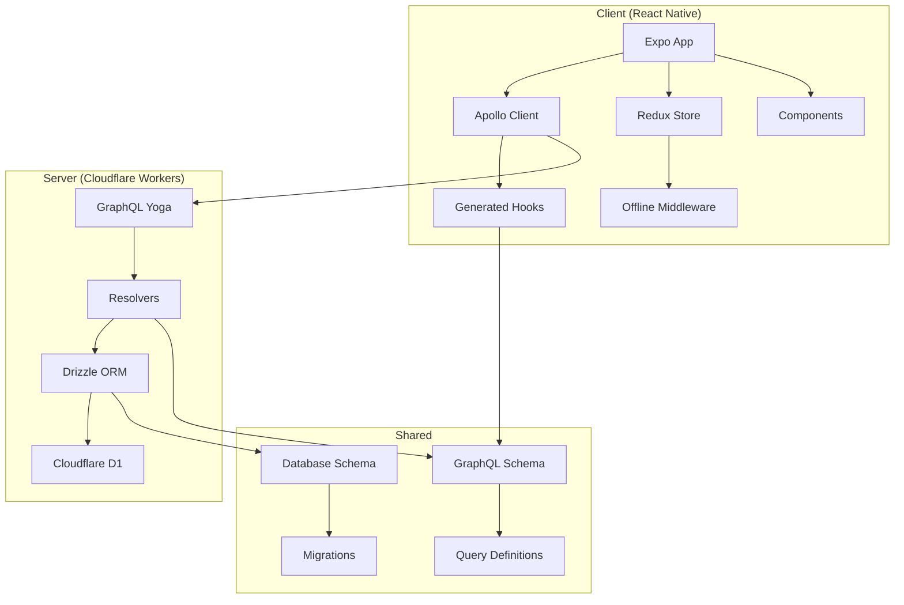
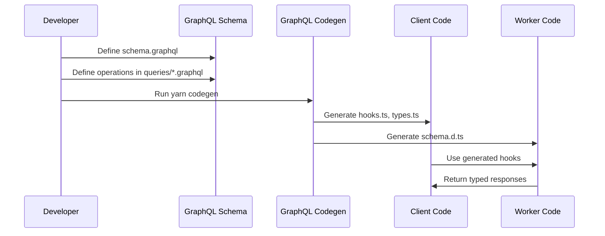
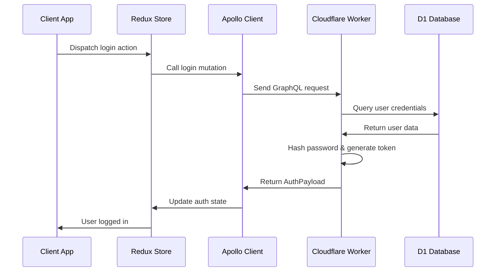
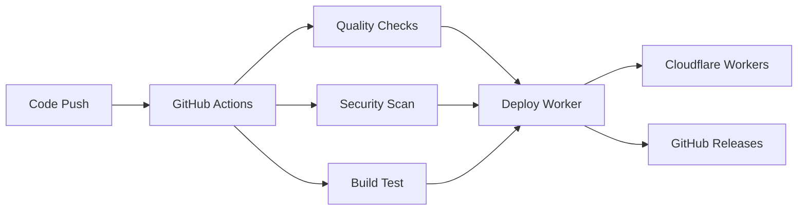

# 🏗️ Architecture

Safarnak follows a modern, type-safe architecture with clear separation between client and server components.

## 🎯 Design Principles

- **Perfect Separation**: Client, server, and shared code are clearly separated
- **Type Safety**: End-to-end type safety with GraphQL Codegen
- **Offline-First**: Redux Persist and offline middleware for seamless UX
- **Developer-Friendly**: Relaxed linting rules for faster development
- **Semantic Versioning**: Automated versioning and release management

## 🏛️ System Architecture



## 📁 Directory Structure

### Core Directories

```
safarnak.app/
├── worker.ts                    # Cloudflare Worker entry point
├── worker/                      # SERVER-SIDE ONLY
│   ├── index.ts                 # Combined resolver exports
│   ├── queries/                 # Query resolvers
│   ├── mutations/               # Mutation resolvers
│   ├── subscriptions/           # Subscription resolvers
│   └── utilities/               # Server utilities (hashing, tokens)
├── graphql/                     # SHARED between client & worker
│   ├── schema.graphql           # Pure GraphQL schema definition
│   ├── queries/                 # Query/mutation definitions (.graphql files)
│   ├── generated/               # Worker-specific schema declarations
│   └── schema-loader.ts         # Worker schema loader
├── api/                         # CLIENT-SIDE ONLY
│   ├── client.ts                # Apollo Client setup
│   ├── hooks.ts                 # Auto-generated React Apollo hooks
│   ├── types.ts                 # Auto-generated GraphQL types
│   ├── mutations/                # Client mutation wrappers
│   ├── queries/                  # Client query wrappers
│   └── subscriptions/           # Client subscription wrappers
├── drizzle/                     # SHARED database layer
│   ├── schema.ts                # Database schema
│   └── migrations/              # SQL migration files
├── store/                       # CLIENT Redux state management
│   ├── index.ts                 # Store configuration
│   ├── slices/                  # Redux slices
│   └── middleware/              # Redux middleware
└── app/                         # CLIENT Expo Router pages
```

## 🔄 Data Flow

### 1. GraphQL Schema Definition

**Shared Schema** (`graphql/schema.graphql`):
```graphql
type User {
  id: ID!
  username: String!
  createdAt: String!
}

type Message {
  id: ID!
  content: String!
  user: User!
  createdAt: String!
}

type Query {
  me: User
  getMessages: [Message!]!
}

type Mutation {
  register(username: String!, password: String!): AuthPayload!
  login(username: String!, password: String!): AuthPayload!
  addMessage(content: String!): Message!
}

type Subscription {
  newMessages: Message!
}
```

### 2. Code Generation Workflow



### 3. Client-Server Communication

**Client Side** (`api/mutations/login.ts`):
```typescript
import { useLoginMutation } from '../hooks';

export const useLogin = () => {
  const [loginMutation, { loading, error }] = useLoginMutation();
  
  const login = async (username: string, password: string) => {
    const result = await loginMutation({
      variables: { username, password }
    });
    return result.data?.login;
  };
  
  return { login, loading, error };
};
```

**Server Side** (`worker/mutations/login.ts`):
```typescript
export const login = async (_, { username, password }, context) => {
  const db = drizzle(context.env.DB);
  
  // Find user
  const user = await db.select()
    .from(users)
    .where(eq(users.username, username))
    .get();
    
  if (!user || !comparePassword(password, user.passwordHash)) {
    throw new Error('Invalid credentials');
  }
  
  // Generate token
  const token = generateToken(user.id, user.username);
  
  return { user, token };
};
```

## 🗄️ Database Architecture

### Schema Design

**Users Table**:
```typescript
export const users = sqliteTable('users', {
  id: integer('id').primaryKey({ autoIncrement: true }),
  username: text('username').notNull().unique(),
  passwordHash: text('password_hash').notNull(),
  createdAt: text('created_at').notNull().default(sql`CURRENT_TIMESTAMP`)
});
```

**Messages Table**:
```typescript
export const messages = sqliteTable('messages', {
  id: integer('id').primaryKey({ autoIncrement: true }),
  content: text('content').notNull(),
  userId: integer('user_id').notNull().references(() => users.id),
  createdAt: text('created_at').notNull().default(sql`CURRENT_TIMESTAMP`)
});
```

### Migration Strategy

1. **Schema Changes**: Modify `drizzle/schema.ts`
2. **Generate Migration**: `yarn db:generate`
3. **Apply Migration**: `yarn db:migrate`
4. **Update GraphQL**: Modify `graphql/schema.graphql` if needed
5. **Regenerate Types**: `yarn codegen`

## 🔐 Authentication Flow



### Security Features

- **Password Hashing**: PBKDF2 with 100,000 iterations
- **Token Generation**: SHA-256 based tokens with timestamps
- **Input Validation**: Server-side validation in resolvers
- **SQL Injection Protection**: Drizzle ORM prevents SQL injection

## 🌐 Offline-First Strategy

### Client-Side Persistence

**Redux Persist Configuration**:
```typescript
const persistConfig = {
  key: 'root',
  storage: AsyncStorage,
  whitelist: ['auth', 'theme']
};
```

**Offline Middleware**:
```typescript
const offlineMiddleware: Middleware = (store) => (next) => (action) => {
  if (action.type.endsWith('/pending')) {
    // Queue mutation for later sync
    queueOfflineMutation(action);
  }
  return next(action);
};
```

### Sync Strategy

1. **Queue Failed Mutations**: Store in AsyncStorage
2. **Detect Connection**: Use NetInfo to monitor connectivity
3. **Retry Queue**: Process queued mutations when online
4. **Optimistic Updates**: Update UI immediately, sync in background

## 🎨 State Management

### Redux Store Structure

```typescript
interface RootState {
  auth: {
    user: User | null;
    token: string | null;
    isAuthenticated: boolean;
    loading: boolean;
  };
  theme: {
    isDark: boolean;
    systemTheme: boolean;
  };
}
```

### State Flow

1. **Authentication**: Login/logout actions update auth state
2. **Theme**: System preference and manual toggle
3. **Offline**: Queue mutations when offline
4. **Persistence**: State survives app restarts

## 🔧 Development Tools

### Type Safety

- **GraphQL Codegen**: Auto-generates TypeScript types
- **Drizzle ORM**: Type-safe database queries
- **Redux Toolkit**: Type-safe state management
- **TypeScript**: Enhanced type checking (relaxed for development)

### Code Quality

- **ESLint**: Developer-friendly linting rules
- **Prettier**: Code formatting (optional)
- **Husky**: Git hooks for pre-commit checks
- **Commitlint**: Conventional commit validation

## 🚀 Performance Optimizations

### Client-Side

- **React.memo**: Prevent unnecessary re-renders
- **useCallback**: Memoize functions passed as props
- **useMemo**: Memoize expensive calculations
- **Apollo Cache**: Efficient GraphQL caching

### Server-Side

- **Cloudflare Edge**: Global CDN distribution
- **D1 Database**: Serverless SQLite with edge replication
- **GraphQL**: Efficient data fetching with single endpoint
- **Drizzle ORM**: Optimized query generation

## 🔄 Deployment Architecture

### CI/CD Pipeline



### Environment Strategy

- **Development**: Local D1 database, local worker
- **Staging**: Cloudflare D1 staging, worker preview
- **Production**: Cloudflare D1 production, worker deployment

---

**Next**: Learn about [Development Guide](Development-Guide) for coding standards and workflows.
